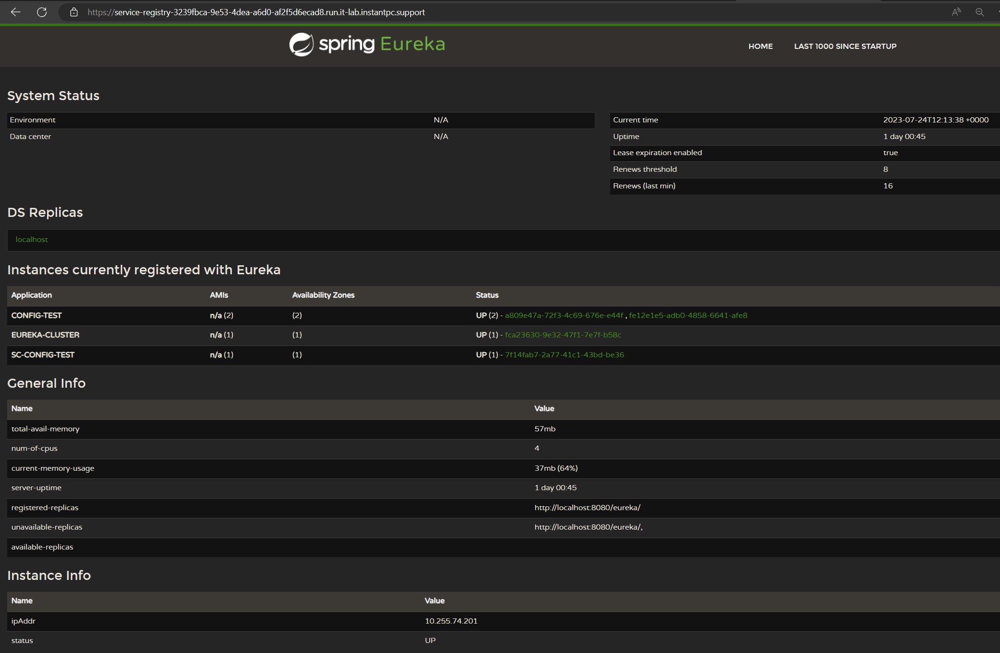

# sc-config-test

is a simple Spring Cloud application to test communication to a Spring Cloud Config Server, and a Eureka based Spring Cloud Config Registry. It was built so that it can be deployed and use the services under a Cloudfoundry deployment.

## Deploy

* clone

```
git clone https://github.com/itsouvalas/sc-config-test.git
```

* build

```
mvn package
```

* push

```
cf push test --no-start -p target/test-0.0.1-SNAPSHOT.jar
```

## Usage

The push command above deploys the application in a stopped state, and for a good reason. Given that we are testing the communication to the config-server and service-registry as those are deployed and become available through cloudfoundry and the corresponding VCAP serivces, we ought to bind them first:

If you deployed the services using the [SCS-BROKER](https://github.com/itsouvalas/cf-genesis-kit/blob/scs-doc-test/SCS-BROKER.md) then your services should be deployed as applications on the `scs` space:

`cf a`
```bash
Getting apps in org system / space scs as admin...

name                                                    requested state   processes           routes
config-server-cb108deb-d302-4d2b-9fa0-0b9744cdf00f      started           web:1/1, task:0/0   config-server-cb108deb-d302-4d2b-9fa0-0b9744cdf00f.run.it-lab.instantpc.support
scs-broker                                              started           web:1/1             scs-broker.run.it-lab.instantpc.support
service-registry-3239fbca-9e53-4dea-a6d0-af2f5d6ecad8   started           web:1/1, task:0/0   service-registry-3239fbca-9e53-4dea-a6d0-af2f5d6ecad8.run.it-lab.instantpc.support
sc-config-test                                                    started           web:1/1, task:0/0   test.run.it-lab.instantpc.support
```

and should also appear under services

`cf s`

```bash
name               service            plan      bound apps                                              last operation     broker       upgrade available
config-server      config-server      default                                                           create succeeded   scs-broker   
service-registry   service-registry   default                                                           create succeeded   scs-broker
```

### Bind the service-registry

`cf bind-service sc-config-test service-registry`

This will result in a similar set of environment variables for the `sc-config-test` app:

```yaml
System-Provided:
VCAP_SERVICES: {
  "service-registry": [
    {
      "binding_guid": "06cada14-8650-455b-a835-0088f4ab2258",
      "binding_name": null,
      "credentials": {
        "access_token_uri": "https://uaa.system.it-lab.instantpc.support/oauth/token",
        "client_id": "service-registry-binding-06cada14-8650-455b-a835-0088f4ab2258",
        "client_secret": "oq1GbKZRnUlZm4TYFu2l6HYLmNnP6h",
        "uri": "https://service-registry-3239fbca-9e53-4dea-a6d0-af2f5d6ecad8.run.it-lab.instantpc.support"
      },
      "instance_guid": "3239fbca-9e53-4dea-a6d0-af2f5d6ecad8",
      "instance_name": "service-registry",
      "label": "service-registry",
      "name": "service-registry",
      "plan": "default",
      "provider": null,
      "syslog_drain_url": null,
      "tags": [
        "snw",
        "service-registry"
      ],
      "volume_mounts": []
    }
  ]
}
```

### Custom env vars

Depending on your default java version, you'd like to also set the version to 17.+

`cf set-env sc-config-test JBP_CONFIG_OPEN_JDK_JRE '{jre: { version: 17.+ }}'`

### Start the application

`cf start sc-config-test`

With the application starting you should be able to tail for the logs

### Application Logs

On the first run we will see important log lines related to the config server:

`cf logs sc-config-test`

```log
2023-07-24T11:55:48.06+0000 [APP/PROC/WEB/0] OUT 2023-07-24 11:55:48.064  INFO 10 --- [           main] com.netflix.discovery.DiscoveryClient    : Discovery Client initialized at timestamp 1690199748063 with initial instances count: 3
   2023-07-24T11:55:48.06+0000 [APP/PROC/WEB/0] OUT 2023-07-24 11:55:48.065  INFO 10 --- [           main] o.s.c.n.e.s.EurekaServiceRegistry        : Registering application SC-CONFIG-TEST with eureka with status UP
   2023-07-24T11:55:48.06+0000 [APP/PROC/WEB/0] OUT 2023-07-24 11:55:48.066  INFO 10 --- [           main] com.netflix.discovery.DiscoveryClient    : Saw local status change event StatusChangeEvent [timestamp=1690199748066, current=UP, previous=STARTING]
   2023-07-24T11:55:48.07+0000 [APP/PROC/WEB/0] OUT 2023-07-24 11:55:48.068  INFO 10 --- [nfoReplicator-0] com.netflix.discovery.DiscoveryClient    : DiscoveryClient_SC-CONFIG-TEST/7f14fab7-2a77-41c1-43bd-be36: registering service...
```

:heavy_exclamation_mark: **Important**

The communication to the dpeloyed services requires the presence of valid certificates. Make sure that using `curl` without the `-k` option from the application(`cf ssh sc-config-test`) to the deployed services returns anything but an ssl error.

## Testing the service-registry

The log lines above show us that it has successfully registered the application to the Eureka Service Registry.

Through the routes deployed against your service-registry application, visit the url (i.e. https://service-registry-3239fbca-9e53-4dea-a6d0-af2f5d6ecad8.run.it-lab.instantpc.support ). You should be greeted with the follwing page:



In this example we can see two instances of the `CONFIG-TEST` app and one of the `SC-CONFIG-TEST` we deployed above.

## Testing the config-server

The [Spring Cloud Config Server](https://cloud.spring.io/spring-cloud-config/multi/multi__spring_cloud_config_server.html) _provides an HTTP resource-based API for external configuration (name-value pairs or equivalent YAML content)_. In order fo the service to be instantiated you need to provide a config file in `json` format so that it serves the corresponding properties of the spring cloud app that uses it:

`configtest-config.json`

```json
{
  "forward-headers-strategy": "framework",
  "health": {
    "enabled": false
  },
  "git": {
    "uri": "https://github.com/itsouvalas/sc-app-config.git"
          }
}
```

in the above example we are using `https://github.com/itsouvalas/sc-app-config.git` as the repository that hold the properties we would like to share to our application:

`sc-config-test-development.properties`

```bash
message=Success! - You have succesfully configured your Spring Cloud App to use the config server
```

to create the service instance issue the following:

```bash
cf create-service config-server default config-server -c configtest-config.json
```

## Bind the config-server

`cf bind-service sc-config-test config-server`

This will result in a similar set of environment variables for the `sc-config-test` app:

```yaml
VCAP_SERVICES: {
  "config-server": [
    {
      "binding_guid": "593f3636-2ab9-49ff-a975-bf996bd26726",
      "binding_name": null,
      "credentials": {
        "access_token_uri": "https://uaa.system.it-lab.instantpc.support/oauth/token",
        "client_id": "config-server-binding-593f3636-2ab9-49ff-a975-bf996bd26726",
        "client_secret": "ZG1xPzFBf3520NpPgPUzgNgbSctqrD",
        "uri": "https://config-server-cb108deb-d302-4d2b-9fa0-0b9744cdf00f.run.it-lab.instantpc.support"
      },
      "instance_guid": "cb108deb-d302-4d2b-9fa0-0b9744cdf00f",
      "instance_name": "config-server",
      "label": "config-server",
      "name": "config-server",
      "plan": "default",
      "provider": null,
      "syslog_drain_url": null,
      "tags": [
        "snw",
        "config-server"
      ],
      "volume_mounts": []
    }
  ],
  "service-registry": [
    {
      "binding_guid": "02253208-0b43-43ee-88bd-d403790d77f0",
      "binding_name": null,
      "credentials": {
        "access_token_uri": "https://uaa.system.it-lab.instantpc.support/oauth/token",
        "client_id": "service-registry-binding-02253208-0b43-43ee-88bd-d403790d77f0",
        "client_secret": "1M5EmeiacBeRa02o958xVk73hkFOVR",
        "uri": "https://service-registry-3239fbca-9e53-4dea-a6d0-af2f5d6ecad8.run.it-lab.instantpc.support"
      },
      "instance_guid": "3239fbca-9e53-4dea-a6d0-af2f5d6ecad8",
      "instance_name": "service-registry",
      "label": "service-registry",
      "name": "service-registry",
      "plan": "default",
      "provider": null,
      "syslog_drain_url": null,
      "tags": [
        "snw",
        "service-registry"
      ],
      "volume_mounts": []
    }
  ]
}
```

notice that this time around we have both services availalbe.

Now visit the `sc-config-test` route (i.e. https://sc-config-test.run.it-lab.instantpc.support/ ). You should read the folowing message:

`Default message Value-Property not retrieved`

Now use the refresh actuator by doing a curl post:

```bash
curl -k -XPOST https://config-test.run.it-lab.instantpc.support:50444/actuator/refresh
```

You should see `["message"]` returned as this is the value that got updated. Now visit the deployed route once again and you should read:

`Success! - You have succesfully configured your Spring Cloud App to use the config server`

## Details


### [TestApplication.java](src/main/java/com/cloudconfig/test/TestApplication.java)

The `TestApplication` class is a Spring Boot application in the `com.cloudconfig.test package`. It serves as a RESTful web service that interacts with the Spring Cloud Config server and is registered as a Eureka client for service discovery. The class is also enabled for dynamic property refreshing using Spring Cloud Config and the `@RefreshScope` annotation.

```javascript
@SpringBootApplication
```
Main Application Class

```javascript
@EnableEurekaClient
```
Indicate that the application should register itself as a client with the Eureka Server

```javascript
@RefreshScope
```
Enables dynamic property refreshing

```javascript
@RestController
```
Marks the class as a controller that handles incoming HTTP requests and returns HTTP responses.

```javascript
@Value("${message:Default message Value-Property not retrieved}")
String welcomeText;
```

Inject value from external configuration resources, also supply a default value to allow for the application to build and set's the string `welcomeText`:

```bash
org.springframework.beans.factory.BeanCreationException: Error creating bean with name 'messageController': Injection of autowired dependencies failed; nested exception is java.lang.IllegalArgumentException: Could not resolve placeholder 'message' in value "${message}"
```

```javascript
	public static void main(String[] args) {
		SpringApplication.run(TestApplication.class, args);
	}
```
Main method

```javascript
    @RequestMapping(value = "/")
    public String welcomeText() {
        return welcomeText;
    }
```
`@RequestMapping` method that maps the root ("/") URL of the application to handle incoming HTTP GET requests. When a request is made to the root URL, the `welcomeText()` method will be invoked, and it will return the value of the welcomeText variable.

### [EurekaConfiguration.java](src/main/java/com/cloudconfig/test/EurekaConfiguration.java)

The EurekaConfiguration class is a Spring `@Configuration` class in the `com.cloudconfig.test package`. It is used to configure the properties of the Eureka instance for a microservice that is intended to be a Eureka client.

```javascript
@Configuration
```

This annotation indicates that the `EurekaConfiguration` class is a Spring configuration class. It is used to define beans and configure components for the Spring application context.

```javascript
@Autowired
```

This annotation enables Spring to automatically inject the `EurekaInstanceConfigBean` bean into the `eurekaInstanceConfig` field. The `EurekaInstanceConfigBean` is a Spring Cloud component that holds the configuration for the Eureka client instance.

```javascript
@PostConstruct
```
This annotation marks the `init()` method to be executed after the bean has been constructed and its dependencies (in this case, the `eurekaInstanceConfig` bean) have been injected.

```javascript
public void init() {
    eurekaInstanceConfig.setAppname("sc-config-test");
}
```

This method is called after the `EurekaInstanceConfigBean` has been injected, and it is used to customize the Eureka instance configuration before it is registered with the Eureka server. In this example, the method sets the `appname` property of the Eureka instance to `sc-config-test`. This means that the microservice will be registered with the Eureka server using the name `sc-config-test`.

### [application.properties](src/main/resources/application.properties)

 The `application.properties` file contains configuration properties related to Spring Cloud Config, Eureka, logging, and management endpoints.

 `spring.cloud.config.discovery.enabled=true` 
 
 This property enables the Spring Cloud Config client to use service discovery for locating the Config Server. When set to true, the client will try to discover the Config Server using service discovery.

 `spring.application.name=sc-config-test`

 Sets the name of the Spring Boot application to "sc-config-test". This name is used to identify the application in various contexts.

 `spring.cloud.config.name=sc-config-test:`

Specifies the name of the configuration file to be fetched from the Config Server. In this case, the application will fetch a file named "sc-config-test.properties" from the Config Server. While using the profile `development` this will translate to `sc-config-test-development.properties`

`spring.cloud.config.profile=development`

Defines the profile used to fetch configuration data from the Config Server. It fetches configuration properties specific to the "development" profile.

`spring.cloud.config.label=main`

Defines the Git branch (label) from which the application should fetch its configuration. In this case, the "main" branch is used.

`spring.cloud.config.import-check.enabled=false`

Disables the check for importing additional configuration files when using the "include" feature in Spring Cloud Config. (Addresses _No spring.config.import property has been defined_ when packaging)

`eureka.client.serviceUrl.defaultZone=${vcap.services.service-registry.credentials.uri}/eureka/`

Sets the URL for the Eureka server. The value is dynamically fetched from the "service-registry" service's credentials URI found under VCAP_SERVICES.

`spring.cloud.config.uri=${vcap.services.config-server.credentials.uri}`

Sets the URI for the Spring Cloud Config Server. The value is dynamically fetched from the "config-server" service's credentials URI, again, found under VCAP_SERVICES.

`eureka.instances.hostname=${vcap.application.uris[0]}`

Sets the hostname of the Eureka instance. The value is dynamically fetched from the first URI in the "vcap.application.uris" property.

`eureka.instances.nonSecurePort=8080`

Sets the non-secure port for the Eureka instance, which is used for service registration.

`server.port=8080`

Sets the port on which the application will run. The embedded web server will listen on port 8080 for incoming HTTP requests.

`logging.level.org.springframework.boot=DEBUG`

Sets the log level for the Spring Boot framework to "DEBUG", enabling detailed logging for the Spring Boot framework.

`management.endpoints.web.exposure.include=refresh`

Configures the management endpoint that is exposed for refreshing the application's configuration. The "refresh" endpoint allows triggering a dynamic refresh of configuration properties without restarting the application.

`management.endpoint.refresh.enabled=true`

Enables the "refresh" management endpoint, allowing the application's configuration to be refreshed at runtime.

`spring.cloud.bootstrap.enabled=true`

Enables the Spring Cloud Config client to use the bootstrap context for loading configuration properties. The bootstrap context is used to configure the application before the main context is created.

### [bootstrap.properties](src/main/resources/bootstrap.properties)

It is specifically used for configuring the application's bootstrap context, which is responsible for loading the configuration before the main application context is created. This allows the application to fetch configuration properties needed for its setup, especially those required for connecting to a centralized configuration server like Spring Cloud Config.

`spring.cloud.config.uri=${vcap.services.config-server.credentials.uri}`

Sets the URI for the Spring Cloud Config Server. The value is dynamically fetched from the "config-server" service's credentials URI under VCAP_SERVICES. The application will use this URI to connect to the Spring Cloud Config Server to fetch its configuration.

`spring.application.name=config-test`

Sets the name of the Spring Boot application to "config-test". This name is used to identify the application in various contexts and when fetching configuration properties from the Spring Cloud Config Server.

`spring.cloud.config.name=sc-config-test`

Specifies the name of the configuration file to be fetched from the Config Server. In this case, the application will fetch a file named "sc-config-test.properties" from the Spring Cloud Config Server. While using the profile `development` this will translate to `sc-config-test-development.properties`

`spring.cloud.config.profile=development`

Defines the profile used to fetch configuration data from the Config Server. It fetches configuration properties specific to the "development" profile.

`spring.cloud.config.label=main`

This property defines the Git branch (label) from which the application should fetch its configuration. In this case, the "main" branch is used.

